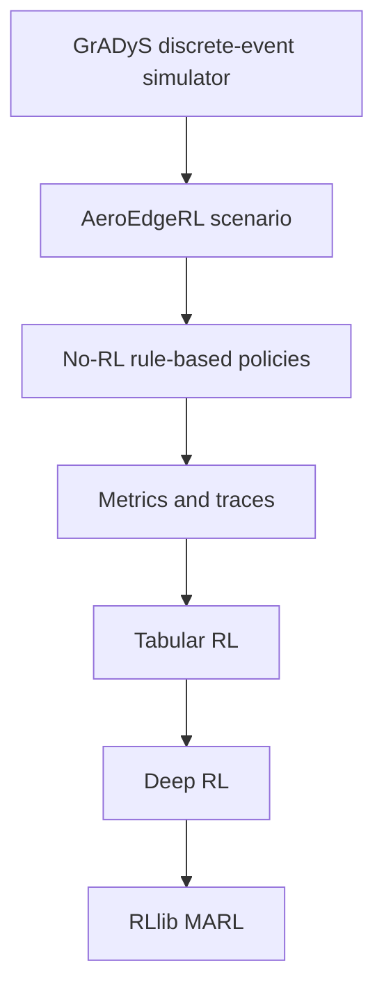

# Lecture 00: Simulation-First Roadmap

## Motivation

The core research object is not an isolated RL algorithm. It is an event-driven
UAV edge intelligence simulator with interchangeable decision policies.

The RL part can be summarized by the usual discounted return,

\[
G_t = \sum_{k=0}^{\infty} \gamma^k R_{t+k+1},
\]

but this quantity is only meaningful after the simulator defines what a time
step, reward event, and episode mean.

This means the teaching sequence must start from:

```text
simulator -> scenario -> metrics -> rule-based policy -> RL algorithm
```

instead of:

```text
RL algorithm -> benchmark toy environment -> simulator later
```

The second order is tempting, but it hides the real problem: in AeroEdgeRL, the
decision policy is only one component in a larger cyber-physical simulation.

## Design Contract

AeroEdgeRL preserves the GrADyS-SIM discrete-event core:

```text
SimulationBuilder
  -> SimulationConfiguration
  -> handlers
  -> protocol-backed nodes
  -> step_simulation / simulated time
```

RL libraries sit outside this core. Gymnasium, PettingZoo, RLlib, and future
AgileRL adapters translate the same scenario into training APIs, but they do not
own event scheduling, mobility updates, protocol behavior, or task lifecycle.

## Teaching Stack



## Inputs And Outputs Of The Teaching Track

Inputs:

- local `gradys-sim-nextgen` editable install;
- `aeroedge-rl` conda environment;
- AeroEdgeRL UAV edge service scenario;
- deterministic seeds and compact experiment configs.

Outputs:

- lecture markdown files;
- runnable CLI examples;
- JSONL traces;
- CSV/JSON metrics;
- later, learned policies and checkpoints.

## Minimum Setup Check

Run:

```bash
conda activate aeroedge-rl
cd /Users/wupengfei/Documents/Framework4test/AeroEdgeRL
python scripts/check_environment.py
```

Expected outcome:

```text
Environment check passed.
```

This check is part of the lecture contract. If `gradysim` resolves to an
installed package instead of the local `gradys-sim-nextgen` clone, do not start
algorithm work.

## First Demonstration Before RL

Before Q-learning, DQN, or PPO, the reader should run:

```bash
python -m aeroedge_rl.experiments.cli.no_rl_demo \
  --policy nearest \
  --num-uavs 1 \
  --num-devices 5 \
  --episode-duration 12 \
  --candidate-limit 3 \
  --output /tmp/aeroedge_no_rl_nearest.jsonl
```

This confirms that the simulator can already produce observations, actions,
rewards, task queues, UAV movement, and metrics without any learning algorithm.
