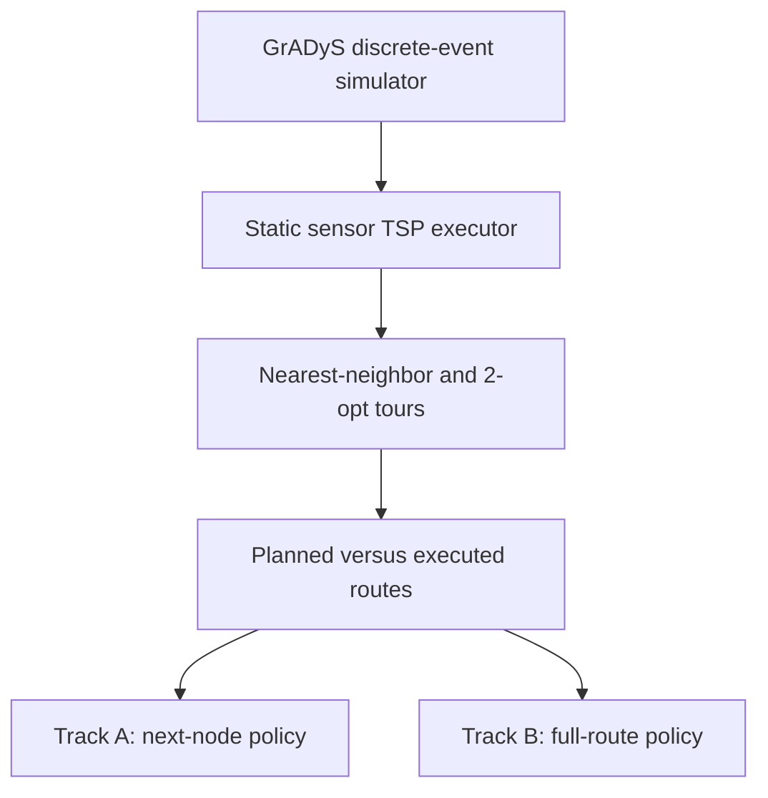

# Lecture 00: Simulation-First Roadmap

## Learning Goals

After this lecture, the reader should be able to:

- identify which layer owns simulated events and which layer chooses actions;
- explain why one policy decision can span several simulator events;
- verify that Python imports the local GrADyS-SIM checkout;
- distinguish the runnable dynamic prototype from the planned first TSP lesson.

## Problem Background

The first formal teaching problem is a closed
[static sensor TSP](../scenarios/static_sensor_tsp.md): one UAV visits every
fixed sensor and returns to the depot. Route construction is a combinatorial
decision; GrADyS-SIM supplies movement and visit events. Task values,
deadlines, dynamic arrivals, queues, and offloading are absent from this first
problem. The existing dynamic edge-service environment remains a framework
prototype and provides the current runnable simulator check.

The teaching sequence is:

```text
simulator semantics -> static TSP instance -> no-RL tour
                    -> GrADyS execution -> learning formulation
```

## Theory: Events And Decisions

Let \(\tau_n\) denote the simulated time of event \(n\), and let \(t_k\)
be the time of control decision \(k\). At \(t_k\), a policy selects action
\(a_k\). The scenario requests an advance of `control_interval` \(\Delta\)
and returns an observation and reward after the simulator processes events:

\[
(o_{k+1},r_k,d_k)=F_{\Delta}(x_k,a_k,\xi_k).
\]

Here \(x_k\) is the simulator and scenario state, \(\xi_k\) collects sampled
workload and event outcomes, and \(d_k\) indicates episode completion. The
control index \(k\) is not an event index \(n\): several events may occur
during one decision interval. The current bridge repeatedly executes whole
events until simulated time reaches or exceeds the requested boundary. Thus
\(t_{k+1}\) can be slightly greater than \(t_k+\Delta\), including at the
configured episode duration. We will inspect this implementation in
[Lecture 01](01_gradys_core_in_aeroedge.md).

An RL objective may later use discounted return,

\[
G_k = \sum_{j=0}^{T-k-1} \gamma^j r_{k+j},
\]

where \(T\) counts control decisions in an episode. Its interpretation depends
on how the scenario aggregates events into \(r_k\), when the episode ends,
and what information appears in \(o_k\).

## AeroEdgeRL Contract

AeroEdgeRL preserves the GrADyS-SIM discrete-event core:

```text
SimulationBuilder
  -> SimulationConfiguration
  -> handlers
  -> protocol-backed nodes
  -> step_simulation / simulated time
```

The existing `GradysUAVServiceCoreEnv` wraps the simulator for the older
dynamic edge-service prototype. A static TSP route executor has not been
implemented yet. Both future TSP research tracks will use the preserved
GrADyS core; one chooses the next unvisited sensor, and the other supplies
a complete permutation before execution.

| Owner | Input | Output |
| --- | --- | --- |
| GrADyS-SIM core | Nodes, handlers, scheduled events, protocol commands | Advanced simulated time and node state. |
| Static TSP scenario (planned) | Depot, fixed sensors, route or next-node action | Visit events, executed positions, tour completion. |
| Route solver or policy (planned) | Shared TSP instance and valid-node mask | Complete permutation or next sensor ID. |
| Experiment runner (planned) | Instance, solver, executor | Tour cost, execution trace, trajectory. |

## Teaching Stack



## Minimal Runnable Example

Use the clean `aeroedge-rl` environment with editable installs of AeroEdgeRL
and the local `gradys-sim-nextgen` checkout. The first check is:

Run:

```bash
conda activate aeroedge-rl
cd /Users/wupengfei/Documents/Framework4test/AeroEdgeRL
python scripts/check_environment.py
```

The script prints the Python executable and version, `aeroedge_rl` version,
`gradysim` and mobility-module paths, and finally:

```text
Environment check passed.
```

When a sibling `gradys-sim-nextgen` directory exists, the script checks that
`gradysim` was imported from it. On another host, set
`AEROEDGE_GRADYSIM_ROOT` to the absolute local checkout path to enforce the
same check. It also checks for
`DynamicVelocityMobilityConfiguration`. A passing check confirms import
provenance and this required API; it is not a simulator behavior test.

The static TSP CLI is still planned. For now, run a short trace of the
separate dynamic edge-service prototype to check the current simulator
integration:

```bash
python -m aeroedge_rl.experiments.cli.no_rl_demo \
  --policy nearest \
  --seed 7 \
  --num-uavs 1 \
  --num-devices 5 \
  --episode-duration 12 \
  --candidate-limit 3 \
  --output /tmp/aeroedge_no_rl_nearest.jsonl
```

## Simulation Effect

The command prints a line for each control step with simulated time, selected
actions, reward sum, pending task count, hits, and misses. It writes a JSONL
trace containing action masks, candidate task IDs, reward values, and metric
snapshots. Add `--plot-output /tmp/aeroedge_no_rl_nearest.png` to save a
trajectory plot; the JSONL trace includes positions before and after each
decision interval.

Success here means the environment imports correctly and this prototype's
decision loop runs to an episode ending. It is not a TSP route execution.
Its detailed pages live under the [existing edge-service prototype](../scenarios/uav_edge_service.md).
Formal TSP Lectures 02-04 remain planned until the route solvers and GrADyS
executor are runnable.

## Common Mistakes

- Treating `control_interval` as the spacing between individual simulator
  events; it is the requested interval between policy decisions.
- Trusting an import from an older installed `gradysim` package because the
  Python import itself succeeds.
- Reading one short trace as a policy comparison or research result.
- Assuming the nominal episode duration is an exact stop timestamp; the
  event-wise bridge can step past it by one event.

## Next Step

Continue to [Lecture 01: GrADyS Core In AeroEdgeRL](01_gradys_core_in_aeroedge.md)
to inspect how the scenario builds and advances the event-driven simulator.
