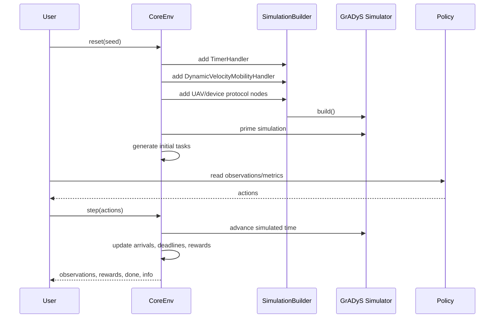

# Lecture 01: GrADyS Core In AeroEdgeRL

## Learning Goals

After this lecture, the reader should understand:

- what AeroEdgeRL preserves from GrADyS-SIM;
- how nodes, protocols, handlers, and simulated time fit together;
- how AeroEdgeRL wraps this simulator into a scenario-level environment;
- why RL is an adapter layer, not the simulator core.

## GrADyS-SIM Concepts We Keep

GrADyS-SIM is built around a Python event-based simulator for quick prototyping
and learning. Its documentation emphasizes protocol logic running inside
network nodes, with movement and communication supplied by simulator interfaces.

AeroEdgeRL keeps this model:

```text
Protocol
  user-defined node logic

Node
  a simulated entity with position and protocol state

Handler
  simulator service such as timer, mobility, communication, visualization

SimulationBuilder
  creates nodes, adds handlers, and builds the simulator

Simulator
  owns event-loop execution and simulated time
```

## AeroEdgeRL Core Scenario

The current teaching scenario is:

```text
UAV edge service
```

It contains:

- UAV agents;
- passive edge devices;
- synthetic task arrivals;
- task deadlines;
- compute demands;
- UAV movement through dynamic velocity mobility;
- rule-based or learned task selection policies.

The important class is:

```text
aeroedge_rl.scenarios.uav_edge_service.environment.GradysUAVServiceCoreEnv
```

This core environment deliberately avoids importing Gymnasium, PettingZoo,
RLlib, Ray, Torch, or AgileRL. Those libraries wrap it later.

## Lifecycle



The actual boundary is `GradysUAVServiceCoreEnv.step(actions)`. It assigns
targets, commands protocol velocities, calls `Simulator.step_simulation()`
repeatedly through `_advance_until`, then updates arrivals, service outcomes,
and rewards. A single control decision may process multiple GrADyS events.
The current implementation does not insert an exact control-boundary event,
so the reported time can overshoot the requested boundary. Inspect the
reported `time` field rather than assuming exact multiples of
`control_interval`.

## Inputs

Scenario configuration:

```text
num_uavs
num_devices
area_size
episode_duration
control_interval
candidate_limit
task_arrival_probability
deadline_range
compute_demand_range
data_size_range
seed
```

At the scenario level, we will later model the decision process as an MDP-like
tuple,

\[
\mathcal{M} = \langle \mathcal{S}, \mathcal{A}, P, R, \gamma \rangle,
\]

but AeroEdgeRL does not require an explicit transition matrix \(P(s' \mid s,a)\).
The GrADyS-backed simulator acts as a generative model: given a state and an
action, it advances event time and returns the next observation and reward.

Policy input at each control step:

```text
agent observations
candidate task list
action mask
metrics snapshot
```

## Outputs

The simulator produces:

```text
observations: dict[agent_id, list[float]]
rewards: dict[agent_id, float]
terminated: bool
truncated: bool
infos: dict[agent_id, dict]
metrics_snapshot: dict[str, float]
visualization_snapshot: dict[str, object]
```

`visualization_snapshot()` includes simulated time, UAV and device positions,
pending tasks, selected targets, hits, and misses. The no-RL CLI uses the
position data before and after each action to create trajectory records.

## Minimal Runnable Check

```bash
conda activate aeroedge-rl
cd /Users/wupengfei/Documents/Framework4test/AeroEdgeRL
python scripts/check_environment.py
python -m aeroedge_rl.experiments.cli.no_rl_demo \
  --policy nearest --seed 7 --num-uavs 1 --num-devices 5 \
  --episode-duration 12 --candidate-limit 3 \
  --output /tmp/aeroedge_core_trace.jsonl \
  --plot-output /tmp/aeroedge_core_trajectory.png
```

For this configuration, inspect a JSONL row's `time_before`, `time`,
`agent_positions_before`, and `agent_positions`. The action mask and
`candidate_task_ids` refer to the state at `time_before`; rewards and metrics
refer to the state after advancing to `time`.

## Why This Matters Before RL

An RL algorithm should not be asked to solve an undefined simulator. Before
learning begins, we need to know:

- what an action does to the simulator;
- when simulated time advances;
- what events can happen between two control decisions;
- how tasks arrive and expire;
- what metrics define a good policy.

The next lecture answers these questions through no-RL rule-based policies.
