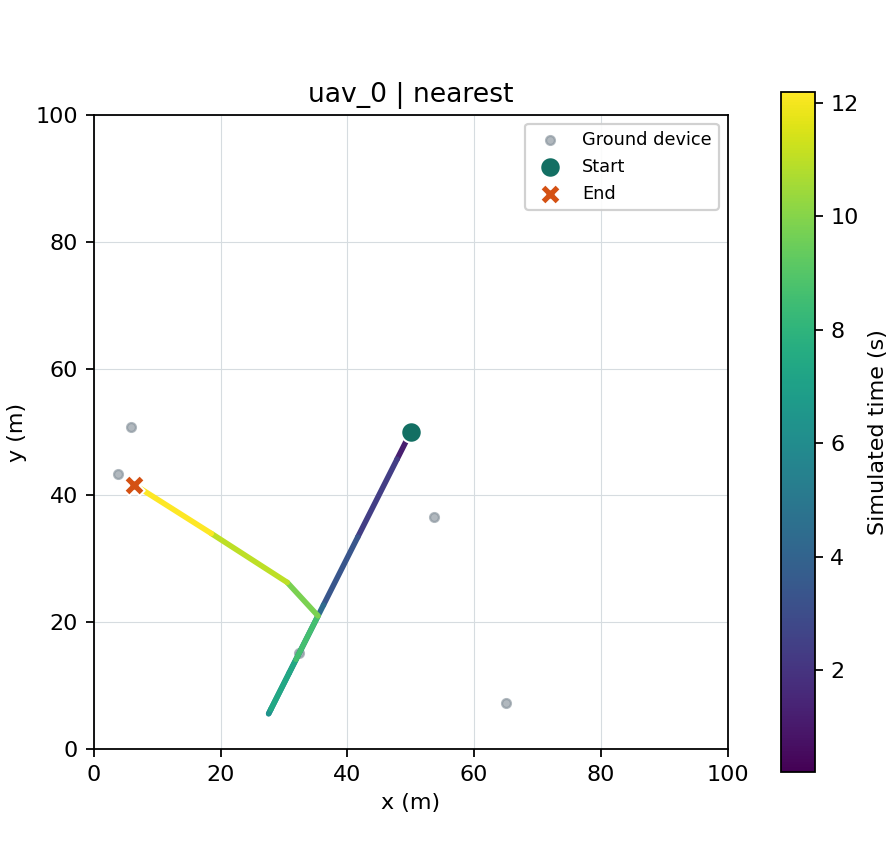

# Lecture 04: Trajectory Data And Visualization

## Learning Goals

This lecture completes the first non-RL example. You will run the environment
check, produce a decision trace, compare heuristic policies, and inspect a UAV
trajectory against service metrics.

## Problem Background

Episode totals tell us whether tasks were served, but not how a UAV reached
them. A path can reveal detours, oscillation, or repeated crossings that a
single reward number hides. Conversely, a clean-looking path can still leave
many tasks pending. The path and metrics must be read together.

## Theory

For UAV \(u\), record its planar position \(p_{u,k}=(x_{u,k},y_{u,k})\)
at every control boundary \(t_k\). A simple sampled path length is

\[
L_u = \sum_{k=0}^{T-1}\lVert p_{u,k+1}-p_{u,k}\rVert_2.
\]

This is a lower bound on the distance traveled between samples. The plotted
segments connect observations at decision boundaries; they do not show every
mobility event inside an interval. The existing `total_energy_used` metric is
a commanded-velocity distance proxy, not this sampled path length or a
physical battery model. Do not equate these three quantities.

## AeroEdgeRL Contract

The no-RL CLI records one JSON object per control step:

| Field | Time represented | Meaning |
| --- | --- | --- |
| `time_before`, `agent_positions_before` | Before action | Decision time and UAV position. |
| `action_masks`, `candidate_task_ids`, `actions` | Before action | Valid choices, their task IDs, and selected action. |
| `time`, `agent_positions`, `target_task_ids` | After step | Updated simulated time, positions, and active targets. |
| `rewards`, `metrics` | After step | Step reward and cumulative scenario metrics. |
| `device_positions` | Static in this scenario | Ground device coordinates. |

The plotter uses the first `agent_positions_before` and every subsequent
`agent_positions`. It draws each UAV in a separate panel with fixed area bounds,
ground devices, start and end markers, and time-colored line segments. The
figure is a visualization of sampled data, not an independent simulator.

## Complete Runnable Example

From the AeroEdgeRL checkout:

```bash
conda activate aeroedge-rl
cd /Users/wupengfei/Documents/Framework4test/AeroEdgeRL
python scripts/check_environment.py
python -m pip install -e ".[viz]"
```

Run and plot a 12-second nominal episode:

```bash
python -m aeroedge_rl.experiments.cli.no_rl_demo \
  --policy nearest --seed 7 --num-uavs 1 --num-devices 5 \
  --episode-duration 12 --candidate-limit 3 \
  --output /tmp/aeroedge_closed_loop_trace.jsonl \
  --plot-output /tmp/aeroedge_closed_loop_trajectory.png
```

Compare the five policies using the same episode seeds:

```bash
python -m aeroedge_rl.experiments.cli.baselines \
  --episodes 3 --seed 7 --num-uavs 1 --num-devices 5 \
  --episode-duration 20 --candidate-limit 3 \
  --policies hover,random,nearest,edf,slo-risk \
  --csv-output /tmp/aeroedge_closed_loop_baselines.csv
```

These are two deliberately different runs: the 12-second trace explains one
policy trajectory, while the 20-second CSV compares policies. Use identical
durations when comparing policies quantitatively.

## Simulation Effect

The trace command was run locally with the documented seed and parameters.
It produced 11 decision rows, 1 hit, 0 misses, and 9 tasks still pending.
The last reported simulated time was 12.2 seconds; GrADyS executed a complete
event past the nominal 12-second boundary. The corresponding plot is:



The line begins near the map center, heads toward the lower-left service
region, then changes direction toward devices on the left. The time colors
allow the turn to be read in order. One turn/crossing here is interpretable;
the figure alone does not prove the route is efficient. In particular, nine
pending tasks remain at the end.

The three-episode CSV comparison gave mean reward 14.21 and mean 1.7 hits for
`nearest`, against -1.09 reward and zero hits for `hover`. This verifies that
the action-to-movement-to-service loop has an observable effect. Three
episodes cannot establish robust policy superiority.

## Evaluation Checklist

1. Verify `gradysim path` points to the intended local checkout.
2. Confirm every selected action was allowed by its recorded pre-step mask.
3. Confirm simulated time increases and every UAV has start/end positions.
4. Read the path with device positions, target changes, hits, misses, and
   pending work. Investigate crossings or oscillations rather than grading
   the picture alone.
5. Compare policies only under matched configuration and episode seeds; use
   more seeds and uncertainty estimates for research claims.

## Common Mistakes

- Treating straight segments as the full event-level mobility trajectory.
- Treating `total_energy_used` as physical battery energy.
- Calling `success_rate` workload completion: pending tasks are excluded.
- Accepting a visually tidy trajectory while the task queue grows.

## Next Step

The no-RL simulation, heuristic comparison, and trajectory inspection now
form a runnable teaching example. Part II can formulate the same scenario as
an MDP. Before any research-grade RL comparison, tighten the control-boundary
timing and add multi-seed trajectory inspection.
